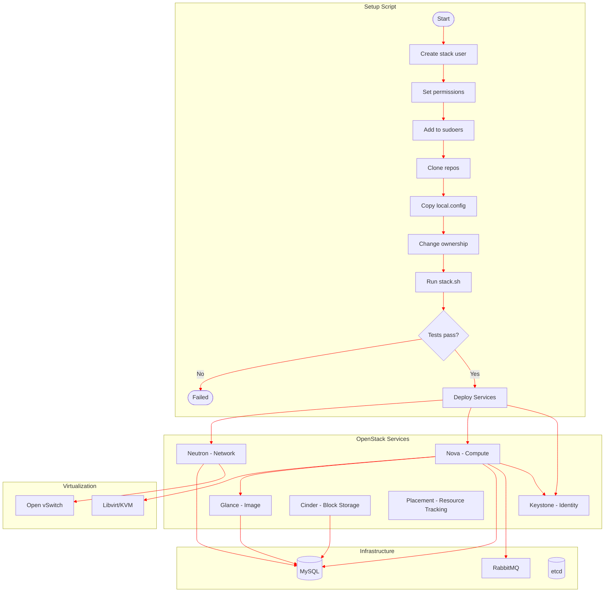

# lvl3-cloud

## Installation

1. Clone or download this repository
2. Create your `local.config.template` file (see example below)
3. Run the setup script:
```bash
curl -L https://raw.githubusercontent.com/4n4k1n/lvl3-cloud/refs/heads/main/scripts/setup.sh | bash
```
## Container Diagram

