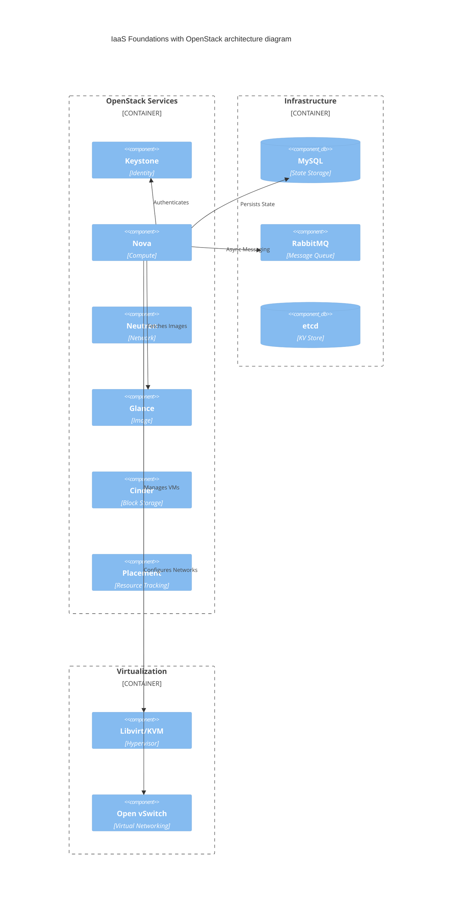

# lvl3-cloud

## Installation

1. Clone or download this repository
2. Create your `local.config.template` file (see example below)
3. Run the setup script:
```bash
chmod +x setup.sh
./setup.sh
```
## Container Diagram

